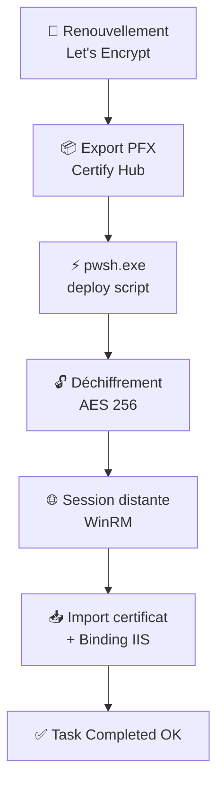

<div align="center">

# 🔐 CertifyScripts — AES + PowerShell 7
# README-Certify-PS7-Task.md

### Automatisation du déploiement de certificats TLS/HTTPS sur serveurs IIS distants
**Certify Management Hub → PowerShell 7 (`pwsh`) → AES-256 → IIS**


</div>

---

## ✨ Ce que fait cette solution

> Renouvelle un certificat sur **un seul serveur central**, et le voit se propager **tout seul**, en toute sécurité, sur tous vos serveurs IIS backend — sans jamais taper un mot de passe en clair.

<table>
<tr>
<td width="50%" valign="top">

### 🎯 Fonctionnalités

- 📦 Export automatique du PFX depuis le Hub
- 🚀 Déploiement multi-serveurs IIS (SRV-WEB-02 / SRV-WEB-03)
- 🔒 Secrets chiffrés en **AES 256 bits** — zéro mot de passe en clair
- ⚡ Compatible **PowerShell 7** (`pwsh.exe`)
- 📝 Logs **UTF-8** propres, sans caractères cassés
- ♻️ Rotation automatique des logs (50 derniers conservés)
- 🗂️ Structure de dossiers claire et portable
- 🔗 Intégration native avec l'API du Certify Management Hub

</td>
<td width="50%" valign="top">

### 🧭 Pipeline en un coup d'œil



</td>
</tr>
</table>

---

## 📁 Structure du dossier

```
PowerShell-pwsh-v7/
│
├── 📂 export/           → Dernier certificat PFX exporté par Certify
│   └── latest.pfx           (écrasé à chaque renouvellement)
│
├── 📂 logs_pwsh/         → Logs UTF-8 des exécutions
│   └── deploy_YYYYMMDD_HHMMSS.log
│
├── 📂 scripts_pwsh/      → Scripts PowerShell 7
│   ├── deploy-cert-to-backends-pwsh-7.ps1
│   └── regenerate-secrets-pwsh-7.ps1
│
└── 📂 secure_pwsh/       → 🔒 Secrets chiffrés (ne JAMAIS versionner)
    ├── aes.key
    ├── deploy-pwd.enc
    └── pfx-pwd.enc
```

<details>
<summary><b>📖 Détail de chaque dossier</b> (cliquer pour développer)</summary>

<br>

| Dossier | Rôle | Notes |
|---|---|---|
| `export/` | Certificat PFX prêt à déployer | Écrasé automatiquement à chaque renouvellement |
| `logs_pwsh/` | Journalisation des déploiements | UTF-8 sans BOM · rotation à 50 fichiers |
| `scripts_pwsh/` | Scripts d'exécution | Toujours lancés via `pwsh.exe`, jamais `powershell.exe` 5.1 |
| `secure_pwsh/` | Secrets chiffrés AES-256 | Clé + 2 fichiers `.enc` — accès restreint |

</details>

---

## ⚙️ Prérequis

### 1️⃣ Installer PowerShell 7

📥 Téléchargement officiel Microsoft : [PowerShell Releases](https://github.com/PowerShell/PowerShell/releases/latest)

```
Fichier   : PowerShell-7.x.x-win-x64.msi
Chemin    : C:\Program Files\PowerShell\7\pwsh.exe
```

### 2️⃣ Configurer la tâche dans Certify Management Hub

> 📍 **Managed Certificate → Tasks → Add Task**

| Champ | Valeur |
|---|---|
| **Task Type** | `Run...` *(provider interne : `ShellExecute`)* |
| **Program/Script** | `C:\Program Files\PowerShell\7\pwsh.exe` |
| **Arguments** | `-File "C:\CertifyScripts\scripts_pwsh\deploy-cert-to-backends-pwsh-7.ps1"` |
| **Launch New Process** | ❌ `false` |
| **Impersonation** | `Default` |
| **LogonType** | `Network` |
| **Timeout** | `5` minutes |
| **Position** | Après la tâche `CertificateExport` |

> 💡 **Pourquoi `ShellExecute` et pas le provider `PowerShell` natif ?**
> Le provider `Certify.Providers.DeploymentTasks.Powershell` est figé sur `powershell.exe` 5.1 — impossible d'y brancher `pwsh.exe`. `ShellExecute` accepte n'importe quel exécutable, c'est la seule voie vers PowerShell 7.

---

## 🔐 Régénération des secrets AES

```powershell
scripts_pwsh\regenerate-secrets-pwsh-7.ps1
```

Ce script génère :

| Fichier | Contenu |
|---|---|
| `secure_pwsh\aes.key` | Clé de chiffrement AES 256 bits (binaire) |
| `secure_pwsh\deploy-pwd.enc` | Mot de passe du compte `svc-certdeploy`, chiffré |
| `secure_pwsh\pfx-pwd.enc` | Mot de passe du PFX, chiffré |

> ⚠️ **À supprimer immédiatement après usage si le script contient des valeurs en clair en dur.** Ne jamais laisser un secret en texte brut traîner sur le disque plus longtemps que nécessaire.

---

## 🚀 Le pipeline complet, étape par étape

```
 1. 🔁  Certify renouvelle le certificat auprès de Let's Encrypt
 2. 📦  Certify exporte latest.pfx → export/
 3. ⚡  Certify lance : pwsh.exe -File deploy-cert-to-backends-pwsh-7.ps1
 4. 🔓  Le script charge la clé AES + déchiffre les secrets
 5. 🌐  Ouverture d'une session distante (WinRM) vers chaque backend
 6. 📥  Copie du PFX → import dans Cert:\LocalMachine\My
 7. 🔗  Mise à jour du binding HTTPS IIS avec le nouveau thumbprint
 8. 🧹  Nettoyage des anciens certificats + du PFX temporaire
 9. 📝  Écriture des logs → logs_pwsh/
10. ✅  Certify marque la tâche : Task Completed OK
```

---

## 🛰️ Comprendre la réponse API du Hub

```http
GET /internal/v1/certificate/{instanceId}/settings/{managedCertId}
```

<table>
<tr><td width="33%" valign="top">

**🪪 Identité du certificat**
- `name`
- `primaryDomain`
- `subjectAlternativeNames`
- `certificateThumbprintHash`
- `certificatePreviousThumbprintHash`

</td><td width="33%" valign="top">

**🔑 Paramètres ACME**
- `challengeType: http-01`
- `performAutoConfig: true`
- `performAutomatedCertBinding: true`
- `deploymentBindingReplacePrevious: true`

</td><td width="33%" valign="top">

**📅 Suivi de renouvellement**
- `dateRenewed`
- `dateExpiry`
- `lastRenewalStatus: 3` *(OK)*
- `certificateRevoked: false`

</td></tr>
</table>

### 🧩 Les deux tâches post-renouvellement (`postRequestTasks`)

**1. Export PFX**
```yaml
taskTypeId: Certify.Providers.DeploymentTasks.CertificateExport
path:       C:\CertifyScripts\export\latest.pfx
type:       pfxfull
strict:     true
```

**2. Déploiement PowerShell 7**
```yaml
taskTypeId: Certify.Providers.DeploymentTasks.ShellExecute
path:       C:\Program Files\PowerShell\7\pwsh.exe
args:       -File "C:\CertifyScripts\pwsh\deploy-cert-to-backends-pwsh-7.ps1"
newprocess: false
timeout:    5
```

---

## 🧪 Test de configuration via l'API

```http
GET /internal/v1/certificate/test?instanceId={{instanceId}}
```

| Vérification | Résultat |
|---|:---:|
| Application Pool — Configuration Override | ✅ |
| Serveur de challenge HTTP opérationnel | ✅ |
| Auto-config HTTP-01 (déjà fonctionnel, vérif. allégée) | ✅ |

---

## 🛡️ Sécurité — ce qui est garanti par cette architecture

- ✅ Chiffrement **AES 256 bits** pour tous les secrets
- ✅ **Aucun** mot de passe en clair dans la configuration du Hub
- ✅ **Aucun** secret laissé sur les serveurs distants après déploiement
- ✅ Sessions **PowerShell Remoting** authentifiées (compte de service dédié)
- ✅ Logs UTF-8 propres, sans fuite d'information sensible
- ✅ Rotation automatique des logs

---

## 📄 Scripts fournis

| Script | Rôle |
|---|---|
| `deploy-cert-to-backends-pwsh-7.ps1` | Déploiement multi-serveurs, mise à jour IIS, nettoyage, logs |
| `regenerate-secrets-pwsh-7.ps1` | Génération/régénération de la clé AES et des secrets chiffrés |

---

<div align="center">

## 🏁 Résumé

**Un pipeline de déploiement de certificats** moderne · sécurisé · automatisé
compatible **PowerShell 7** · **Certify** · **IIS multi-serveurs**
**sans intervention humaine**

</div>

