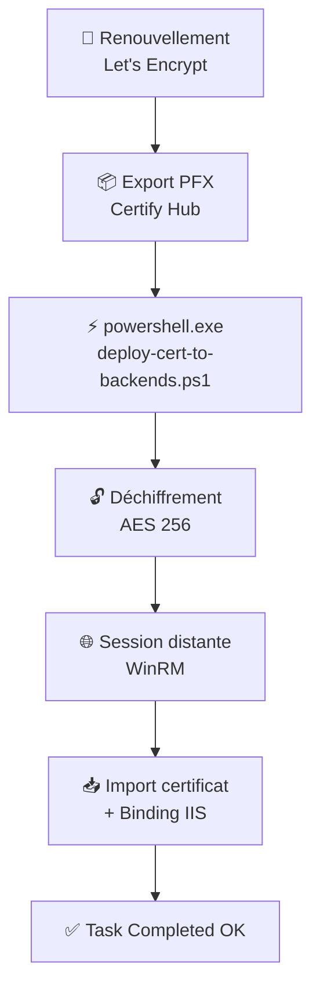

<div align="center">

# 🔐 CertifyScripts — AES + Windows PowerShell 5.1
# README-Certify-PS5.1-Task.md

### Automatisation du déploiement de certificats TLS/HTTPS sur serveurs IIS distants
**Certify Management Hub → Windows PowerShell 5.1 (`powershell.exe`) → AES-256 → IIS**


</div>

---

## ✨ Ce que fait cette solution

> Renouvelle un certificat sur **un seul serveur central**, et le voit se propager **tout seul**, en toute sécurité, sur tous vos serveurs IIS backend (SRV-WEB-02 / SRV-WEB-03) — sans jamais taper un mot de passe en clair.

<table>
<tr>
<td width="50%" valign="top">

### 🎯 Fonctionnalités

- 📦 Export automatique du PFX depuis le Hub (`latest.pfx`)
- 🚀 Déploiement multi-serveurs IIS via WinRM
- 🔒 Secrets chiffrés en **AES 256 bits** avec ACL strictes (SYSTEM & Administrateurs)
- ⚡ Compatible **Windows PowerShell 5.1** (`powershell.exe`)
- 📝 Logs **UTF-8 avec BOM** propres, sans caractères cassés
- ♻️ Rotation automatique des logs (50 derniers conservés)
- 🗂️ Structure de dossiers claire et portable
- 🔗 Intégration native avec l'API du Certify Management Hub (`Certify.Providers.DeploymentTasks.Powershell`)

</td>
<td width="50%" valign="top">

### 🧭 Pipeline en un coup d'œil



</td>
</tr>
</table>

---

## 📁 Structure du dossier

```
C:\CertifyScripts\
│
├── 📂 export\              → Dernier certificat PFX exporté par Certify
│   └── latest.pfx           (écrasé à chaque renouvellement)
│
├── 📂 logs\                → Journalisation des déploiements PowerShell 5.1
│   └── deploy_YYYYMMDD_HHMMSS.log
│
├── 📂 secure\              → 🔒 Clé et secrets chiffrés (ne JAMAIS versionner)
│   ├── aes.key
│   ├── deploy-pwd.enc
│   └── pfx-pwd.enc
│
└── 📄 deploy-cert-to-backends.ps1  → Script principal de déploiement PS 5.1
```

<details>
<summary><b>📖 Détail de chaque dossier</b> (cliquer pour développer)</summary>

<br>

| Dossier / Fichier | Rôle | Notes |
|---|---|---|
| `export/` | Certificat PFX prêt à déployer | Écrasé automatiquement à chaque renouvellement |
| `logs/` | Journalisation des déploiements | UTF-8 avec BOM · rotation à 50 fichiers |
| `secure/` | Clé AES-256 et secrets chiffrés | Accès restreint SYSTEM / Administrateurs via SID |
| `deploy-cert-to-backends.ps1` | Moteur de déploiement IIS via WinRM | Exécuté par le provider natif Certify PowerShell 5.1 |

</details>

---

## ⚙️ Prérequis

### 1️⃣ Topologie et Environnement

| Équipement | Rôle | IP | Détail |
|---|---|---|---|
| **POST-HP** | Poste admin | 192.168.1.x | Exécution Postman (client API), RDP |
| **AD-DC** | Contrôleur de domaine | 192.168.1.x | AD, DNS, DHCP, ADCS-usage pour svc |
| **API-REST** | Reverse Proxy / Hub | 192.168.1.125 | IIS ARR + Certify Management Hub + Scripts PS1 |
| **SRV-WEB-02** | Backend applicatif 1 | 192.168.1.33 | IIS, sans CCM et sans Certify Agent |
| **SRV-WEB-03** | Backend applicatif 2 | 192.168.1.169 | IIS, sans CCM et sans Certify Agent |

### 2️⃣ Configuration de la tâche dans Certify Management Hub

> 📍 **Managed Certificate → Tasks → Add Task** (dans Deployment Task)

| Champ | Valeur |
|---|---|
| **Task Type** | `Run Powershell Script` *(provider API : `Certify.Providers.DeploymentTasks.Powershell`)* |
| **Task Name / Display Name** | `Deploy-cert-to-backends` |
| **Program/Script** | `C:\CertifyScripts\deploy-cert-to-backends.ps1` |
| **Pass Result as First Arg** | ❌ Décoché |
| **Impersonation LogonType** | `Network` |
| **Impersonation Mode** | `Default` |
| **Execution Mode** | `Automatic` (par défaut) |
| **Arguments (optional)** | *(laisser vide — plus aucun secret à transmettre, tous les paramètres ont des valeurs par défaut dans le script)* |
| **Script Timeout Mins.** | `5` minutes |
| **Run task even if previous task step failed** | ❌ Décoché |
| **Position** | Après la tâche `CertificateExport` existante (`postRequestTask`, 2ème position) |

> 🧩 **Seconde tâche associée :** Une tâche d'export nommée `latest.pfx` avec le type `Export Certificat` et `Export As PFX` pointant vers `C:\CertifyScripts\export`.

---

## 🔐 Génération et Initialisation des Secrets AES

> ⚠️ **Procédure à réaliser une seule fois sur le serveur central.**

### Étape 1 : Génération de la clé AES
Exécutez `01.Gen_AES-Key.ps1` en mode Administrateur pour créer `aes.key` et verrouiller ses ACL via les SID (`S-1-5-18` SYSTEM et `S-1-5-32-544` Administrateurs).

### Étape 2 : Chiffrement des mots de passe
Modifiez temporairement `02.ConvertTo-SecureString-aes.ps1` avec vos mots de passe réels (`Password_SVC_Ici` et `Password_PFX_Ici`), puis exécutez-le pour générer `deploy-pwd.enc` et `pfx-pwd.enc`.
> 🛑 **IMPORTANT :** Supprimez immédiatement ce script après exécution pour éviter toute exposition de mots de passe en clair.

### Étape 3 : Sécurisation ACL des fichiers `.enc`
Exécutez `03.secure-enc-file.ps1` pour appliquer des permissions NTFS strictes aux fichiers chiffrés.

---

## 🚀 Le pipeline complet, étape par étape

```
 1. 🔁  Certify renouvelle le certificat auprès de Let's Encrypt
 2. 📦  Certify exporte latest.pfx → C:\CertifyScripts\export\
 3. ⚡  Certify lance : powershell.exe -File C:\CertifyScripts\deploy-cert-to-backends.ps1
 4. 🔓  Le script charge la clé AES + déchiffre les secrets de service
 5. 🌐  Ouverture d'une session distante (WinRM) vers chaque backend (SRV-WEB-02, SRV-WEB-03)
 6. 📥  Copie du PFX → import dans Cert:\LocalMachine\My sur chaque nœud
 7. 🔗  Mise à jour des bindings HTTPS IIS avec le nouveau thumbprint
 8. 🧹  Nettoyage des anciens certificats et du PFX temporaire
 9. 📝  Écriture des logs UTF-8 avec BOM → C:\CertifyScripts\logs\
10. ✅  Certify marque la tâche : Task Completed OK
```

---

## 🛰️ Comprendre la réponse API du Hub

```http
GET /internal/v1/certificate/{instanceId}/settings/{managedCertId}
```

<table>
<tr><td width="33%" valign="top">

**🪪 Identité du certificat**
- `name: api-rest.optimedit.eu`
- `certificateThumbprintHash`
- `certificatePreviousThumbprintHash`

</td><td width="33%" valign="top">

**🔑 Paramètres ACME**
- `challengeType: http-01`
- `performAutoConfig: true`
- `performAutomatedCertBinding: true`

</td><td width="33%" valign="top">

**📅 Suivi de renouvellement**
- `lastRenewalStatus: 3` *(OK)*
- `lastPrimaryRequest.status: 3` *(OK)*
- `lastBindingDeployment.status: 3` *(OK)*

</td></tr>
</table>

---

## 🛡️ Sécurité — ce qui est garanti par cette architecture

- ✅ Chiffrement **AES 256 bits** indépendant du profil utilisateur (compatible SYSTEM)
- ✅ **Contrôle d'accès strict (ACL)** : accès réservé aux comptes SYSTEM et Administrateurs
- ✅ **Aucun** mot de passe en clair stocké dans la configuration du Hub ni sur le disque
- ✅ Sessions **PowerShell Remoting (WinRM)** authentifiées via un compte de service dédié (`OPTIMEDIT\svc-certdeploy`)
- ✅ Logs UTF-8 avec BOM propres, sans fuite d'information sensible
- ✅ Rotation automatique des logs (conservation des 50 plus récents)

---

## 📄 Scripts fournis pour la version PowerShell 5.1

| Script | Rôle | Statut après usage |
|---|---|---|
| `01.Gen_AES-Key.ps1` | Génération de la clé AES et application des ACL strictes. | Conserver |
| `02.ConvertTo-SecureString-aes.ps1` | Chiffrement initial des mots de passe. | **Supprimer immédiatement** |
| `03.secure-enc-file.ps1` | Sécurisation ACL des fichiers `.enc`. | Conserver |
| `deploy-cert-to-backends.ps1` | Moteur de déploiement IIS via WinRM (PowerShell 5.1). | Conserver |

---

<div align="center">

## 🏁 Résumé

**Un pipeline de déploiement de certificats** robuste et industrialisé
compatible **Windows PowerShell 5.1** · **Certify Management Hub** · **IIS multi-serveurs**
**sécurisé par AES-256 et WinRM**

</div>
