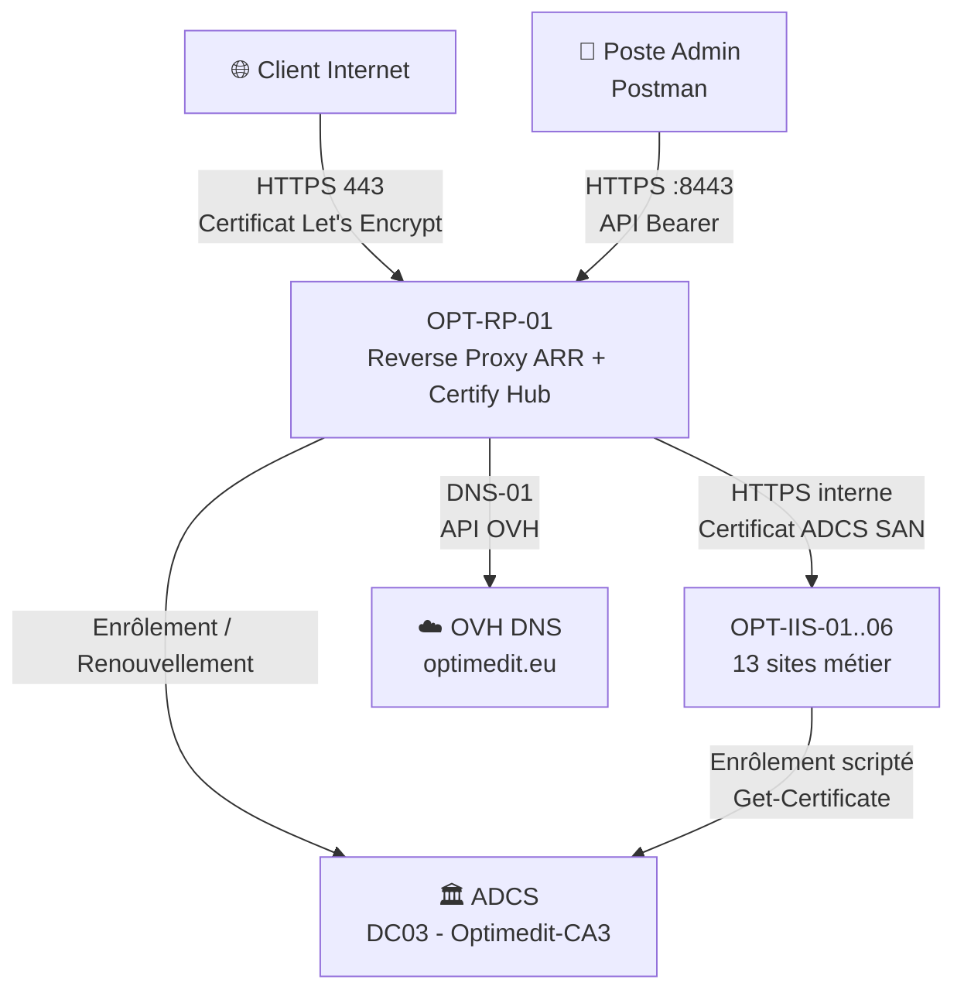

<div align="center">

# 🔐 PKI-Hybride — Certify Management Hub & ADCS

## Infrastructure de gestion de certificats hybride pour Optimedit
**Certify Management Hub (Let's Encrypt) + PKI d'Entreprise (ADCS) + TLS Bridging**


[](https://www.ansible.com/)


</div>

---

## 📌 Présentation du projet

Ce projet implémente une **architecture PKI hybride** pour l'infrastructure **Optimedit**, combinant deux autorités de certification aux rôles complémentaires :

| Composant | Technologie | Usage |
|---|---|---|
| **PKI Publique** | Let's Encrypt via Certify Management Hub | Sécurisation des connexions entrantes depuis Internet (13 sites métier + reverse-proxy) |
| **PKI d'Entreprise** | ADCS (Active Directory Certificate Services) | Sécurisation des échanges internes entre le Reverse-Proxy et les 6 serveurs backend (TLS Bridging) |

L'objectif est de garantir à la fois la **sécurité des accès externes**, la **confidentialité des communications internes**, et une **automatisation complète** du cycle de vie des certificats — de l'émission au déploiement, jusqu'au renouvellement, sans intervention manuelle récurrente.

---

## 🏗️ Architecture cible



### Répartition des rôles

| Serveur | Rôle | PKI utilisée |
|---|---|---|
| `OPT-RP-01` | Reverse Proxy IIS/ARR + Certify Management Hub | Let's Encrypt (public) |
| `DC03` | Autorité de certification d'entreprise (`Optimedit-CA3`) | — |
| `OPT-IIS-01` à `OPT-IIS-06` | 13 sites métier répartis en haute disponibilité | ADCS interne |

---

## 🌍 PKI Publique — Certify Management Hub

- **Émission** : certificat SAN unique couvrant 14 identifiants (`OPT-RP-01.optimedit.eu` + 13 sous-domaines métier).
- **Validation ACME** : `DNS-01` via l'API OVH — permet la validation même sans exposition HTTP directe de chaque sous-domaine.
- **Déploiement** : Auto Deployment natif du Hub, correspondance automatique par nom d'hôte sur les bindings IIS existants.
- **Pilotage** : API REST du Hub, exposée en interne sur `https://opt-rp-01.optimedit.eu:8443`, authentification Bearer JWT.
- **Renouvellement** : automatique, déclenché par le moteur natif du Hub (fenêtre ARI, ~30 jours avant expiration sur un cycle de 90 jours).

### 🔑 API OVH (ACME DNS-01)

- Credentials **Application Key / Application Secret / Consumer Key**, validité illimitée, droits scopés strictement à `GET/POST/DELETE /domain/zone/*`.
- Stockés côté Hub via **Stored Credential** chiffré (Windows Data Protection API).
- Testés et validés indépendamment (création/suppression de TXT `_acme-challenge`, vérifiée par ID de requête OVH).

---

## 🏛️ PKI d'Entreprise — ADCS

### Deux modèles de certificat distincts, deux usages

| Modèle | Usage | Subject Name | Auto-Enrollment GPO |
|---|---|---|---|
| `Ansible-WinRM-FQDN-SERVERS` | Gestion (WinRM, port 5986) | Build from AD (FQDN natif) | ✅ Oui — zéro script |
| `IIS-FQDN-SAN-Auto-Enrollment` | Applications (IIS, port 443 + ports dédiés) | Supply in the request (SAN personnalisé) | ❌ Non — enrôlement scripté (limitation ADCS native, voir ci-dessous) |

> ⚠️ **Point technique important** : un modèle en *"Supply in the request"* (nécessaire pour des SAN personnalisés) est **incompatible avec le moteur Auto-Enrollment GPO silencieux** — c'est une limitation documentée de Microsoft, pas un choix d'architecture. La solution retenue : un **script d'enrôlement identique déployé sur les 6 backends**, déclenché par une **tâche planifiée Windows native**, qui obtient le même résultat (zéro intervention manuelle) sans dépendre du moteur GPO.

### Cycle de vie du certificat backend

1. Script d'enrôlement (`Get-Certificate`) exécuté quotidiennement via tâche planifiée.
2. Vérification d'idempotence (pas de réémission si le certificat en place reste valide > 30 jours).
3. SAN = FQDN propre du serveur + les 13 domaines métier partagés.
4. Reconstruction dynamique des bindings des 13 sites (`443` public SNI + port dédié interne non-SNI), **sans jamais supprimer les bindings HTTP:80** (continuité de service garantie pendant la bascule).
5. Génération d'un rapport structuré JSON + CSV + log détaillé par exécution.

---

## 🛰️ Pilotage API — Postman

- Authentification **Bearer JWT** (`POST /api/v1/auth/login`), scripts de rafraîchissement automatique de session.
- Endpoints exploités : statut des certificats, instances gérées, résumé de santé, configuration des Deployment Tasks.
- Vérification indépendante de la propagation TLS (comparaison de fingerprint de certificat via la Console réseau de Postman, sur les 3 nœuds — proxy + backends).

---

## 🌐 Reverse Proxy — IIS ARR

- **Server Farm** centralisant le routage vers les 6 backends.
- Bascule **SSL Offloading → End-to-End TLS** : passage du trafic interne de HTTP à HTTPS, sans interruption, en désactivant le déchargement SSL au niveau de la Routing Rule.
- Exposition dédiée du Hub (`port 8443`, reverse-proxy interne vers `localhost:8080`), isolée du trafic applicatif public.

---

## 🛡️ Cryptographie & Sécurité des secrets

- **AES 256 bits** avec clé fichier dédiée (indépendante du profil Windows, robuste en exécution SYSTEM/tâche planifiée).
- Alternative **DPAPI (LocalMachine scope)** documentée et testée en parallèle.
- **Aucun mot de passe en clair** dans la configuration du Hub ni dans les Deployment Tasks.
- Comptes de service dédiés (`svc-certdeploy`, `svc_certify`), droits **NTFS/partage restreints au strict nécessaire**.
- Rotation systématique des secrets exposés accidentellement au cours du projet.

---

## 📊 Audit & Supervision

- Script d'audit multi-serveurs (`Audit-Backends-Certificates-internes.ps1`) : contrôle des 6 backends en une exécution — connectivité WinRM, cohérence des bindings, unicité des certificats, dates d'expiration.
- Export **CSV structuré** (156 lignes = 26 bindings × 6 serveurs) + log détaillé horodaté.
- Rapports JSON par backend (`synapse-report-*.json`) : statut, thumbprint, liste des sites traités.
- Zéro certificat manquant, zéro binding orphelin sur le dernier audit de référence.

---

## 🏢 Haute disponibilité

- **6 backends IIS** hébergeant en parallèle les 13 sites métier, chacun avec son propre certificat ADCS local — pas de dépendance à un magasin de certificats partagé unique.
- Répartition de charge via la **Server Farm ARR** côté reverse-proxy.
- Renouvellement de certificat **indépendant par serveur** : l'échec d'un backend n'affecte pas les 5 autres.
- Scripts idempotents et rejouables sans effet de bord — sûrs à ré-exécuter en cas d'incident partiel.

---

## 📁 Structure du dépôt

```
Optimedit-PKI-Hybride/
│
├── Certify-Hub/
│   ├── PowerShell-5.1/          → Déploiement legacy (provider natif)
│   └── PowerShell-pwsh-v7/      → Déploiement recommandé (provider ShellExecute)
│
├── ADCS/
│   ├── Templates/                → Procédures de création des modèles de certificat
│   ├── Scripts/                  → Enrôlement, déploiement, audit
│   └── logs/                     → Historique d'exécution horodaté
│
├── Postman/
│   └── Optimedit-API.postman_collection.json
│
└── Documentation/
    ├── Procedure_Certify_Hub_Optimedit_V4.docx
    └── Fiches techniques (SSL Offloading, End-to-End TLS, CCS, ADCS)
```

---

<div align="center">

## 🏁 Résumé

**Une infrastructure PKI hybride** moderne · sécurisée · automatisée
**Let's Encrypt** (public) + **ADCS** (interne) + **TLS de bout en bout**
pilotable via **API REST** et **Postman**
**haute disponibilité sur 6 backends**, **audit continu**, **zéro intervention manuelle récurrente**

</div>