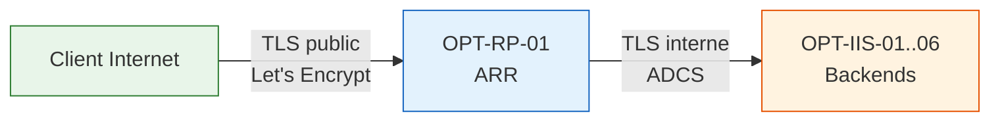

Driss, je comprends parfaitement ce que tu veux. Tu veux un `README.md` pour `03.PKI-Hybride` avec :

1. **La même qualité de présentation** que ton `README-Certify-PS7-Task.md` (badges, tableaux, diagrammes, structure claire)
2. **Le contenu fidèle** à ta procédure V4, avec l'accent sur les phases 1 à 4
3. **La justification claire** du choix `4.3.4` vs `4.3.3`

Je te livre ci-dessous le README complet, prêt à être copié dans `PKI/03.PKI-Hybride/README.md`.

---

```markdown
<div align="center">

# 🔐 PKI-Hybride — Certify Management Hub & ADCS

## Infrastructure de gestion de certificats hybride pour Optimedit

**Certify Management Hub (Let's Encrypt) + PKI d'Entreprise (ADCS) + TLS Bridging**


</div>

---

## 📌 Présentation du projet

Ce projet implémente une **architecture PKI hybride** pour l'infrastructure **Optimedit**, combinant :

| Composant | Technologie | Usage |
|-----------|-------------|-------|
| **PKI Publique** | Let's Encrypt via Certify Management Hub | Sécurisation des connexions entrantes depuis Internet (13 sites) |
| **PKI d'Entreprise** | ADCS (Active Directory Certificate Services) | Sécurisation des échanges internes entre Reverse-Proxy et backends |

L'objectif est de garantir à la fois la **sécurité des accès externes**, la **confidentialité des communications internes**, et une **automatisation complète** du cycle de vie des certificats.

---

## 🏗️ Architecture cible

### Vue d'ensemble

```
Internet
   │
   │ 🌐 TLS Public (Let's Encrypt)
   │    └── 1 certificat SAN : OPT-RP-01 + 13 sous-domaines
   ▼
OPT-RP-01.optimedit.eu (Reverse-Proxy IIS / ARR)
   │
   │ 🔒 TLS Interne (ADCS)
   │    └── 6 certificats par serveur (FQDN + 13 SAN)
   ▼
OPT-IIS-01 ─── OPT-IIS-02 ─── OPT-IIS-03 ─── OPT-IIS-04 ─── OPT-IIS-05 ─── OPT-IIS-06
   │             │             │             │             │             │
   └─────────────┴─────────────┴─────────────┴─────────────┴─────────────┘
                              │
                        13 Sites applicatifs
                        (achat, blog, ce, client, ...)
```

### 🔁 TLS Bridging — le schéma retenu



> **Principe :** ARR déchiffre la session TLS entrante (certificat public Let's Encrypt), puis **rechiffre** le trafic vers les backends avec un certificat ADCS interne. Les deux sessions TLS sont totalement indépendantes.

---

## 📋 Architecture des sites

| Structure | Exemple | Choix du projet |
|-----------|---------|-----------------|
| **13 sous-domaines (13 sites)** | `https://achat.optimedit.eu` | ✅ **X** |
| 13 sous-dossiers (1 site) | `https://optimedit.eu/achat` | ❌ |

**Justification du choix des sous-domaines :**
- Sécurité et isolation granulaires
- Supervision et traçabilité par site
- Maîtrise de la PKI Interne (ADCS)
- Automatisation, évolutivité et flexibilité métier

---

## 🔐 Décision PKI — deux certificats, deux périmètres

| Périmètre | Certificat | SAN inclus |
|-----------|------------|------------|
| **Public (Internet)** | Let's Encrypt via Certify Hub | `OPT-RP-01` + 13 sous-domaines |
| **Interne (Backends)** | ADCS (déployé par Ansible) | 6 FQDN + 13 sous-domaines |

> ✅ **Les 6 backends `OPT-IIS-01..06` sont RETIRÉS du SAN public.**  
> ✅ **Ils conservent leur certificat ADCS interne** — déployé et renouvelé par Ansible.  
> ✅ **Aucune fuite d'information** dans les logs Certificate Transparency (crt.sh).

---

## 📂 Structure du dépôt

```
03.PKI-Hybride/
│
├── Procedure_Certify_Hub_Optimedit_V4.pdf      # 📄 Documentation complète
├── Procedure_Certify_Hub_Optimedit_V4.docx     # 📝 Version éditable
├── architecture_hybride.xlsx                   # 📊 Tableaux de bord
│
├── Scripts/
│   │
│   ├── Phase-01/                               # 🔧 ARR & Infrastructure
│   │   ├── 1.4.1.Deploy-ReverseProxy-Firewall.ps1
│   │   ├── 1.4.1.Deploy-ReverseProxy-Firewall-PortsDedies.ps1
│   │   ├── 1.4.2.Update-DNS-OptimeditSites-RP.ps1
│   │   ├── 1.4.3.Validation.Configuration.Ferme.ARR.ps1
│   │   ├── 1.4.3.Validation.SitesNonAccessiblesBackends.ps1
│   │   └── 1.4.4.Test-LoadBalancing-ARR-AllSites.ps1
│   │
│   └── Phase-04/                               # 🔐 Certificats ADCS
│       ├── 4.3.Test-Optimedit-13-Domains.ps1
│       ├── 4.3.3\ Génération\ d’unique\ certificat\ SAN\ -\ ADCS\ -\ PFX/
│       ├── 4.3.4\ Génération\ de\ multi\ certificats\ SAN\ -ADCS\ -Auto-enrolement/
│       ├── 4.3.5\ Génération\ de\ multi\ certificats\ SAN\ -ADCS\ -Auto-enrolement-RP/
│       └── 4.3.6\ Audits/
│
└── logs/                                       # 📋 Journaux d'exécution
```

---

## 📋 Résumé détaillé des Phases 1 à 4

### ✅ Phase 1 — Reverse-Proxy ARR sur OPT-RP-01

<details>
<summary><b>📖 Déroulé complet (cliquer pour développer)</b></summary>

<br>

| Étape | Action | Validation |
|-------|--------|------------|
| 1.1 | Installation Windows Server, IIS, ARR, URL Rewrite | ✅ Validé |
| 1.2 | Création des 13 sites + HUB, pools IIS dédiés | ✅ Validé |
| 1.3 | Configuration ferme ARR `Optimedit-Web-Farm` + règles Reverse Proxy | ✅ Validé |
| 1.4.1 | Pare-feu backends : seul OPT-RP-01 autorisé sur 80/443 | ✅ Validé |
| 1.4.2 | Mise à jour DNS : 13 sous-domaines → IP publique OPT-RP-01 | ✅ Validé |
| 1.4.3 | Validation : sites non accessibles depuis backends | ✅ Validé |
| 1.4.4 | Test du load balancing ARR sur 6 backends | ✅ Validé |

**Scripts associés :**
- `1.4.1.Deploy-ReverseProxy-Firewall.ps1`
- `1.4.2.Update-DNS-OptimeditSites-RP.ps1`
- `1.4.3.Validation.Configuration.Ferme.ARR.ps1`
- `1.4.4.Test-LoadBalancing-ARR-AllSites.ps1`

</details>

### ✅ Phase 2 — Création de l'API OVH (DNS-01)

<details>
<summary><b>📖 Déroulé complet (cliquer pour développer)</b></summary>

<br>

1. Création d'une application OVH avec les droits :
   - `GET /domain/zone/*`
   - `POST /domain/zone/*`
   - `DELETE /domain/zone/*`

2. Obtention du triplet :
   - **Application Key**
   - **Application Secret**
   - **Consumer Key**

3. Stockage sécurisé des credentials (Ansible Vault / KeePass / Azure Key Vault)

> ⚠️ **Sécurité :** Ces credentials permettent de modifier toute la zone DNS `optimedit.eu`. Ils doivent être traités comme des secrets sensibles.

</details>

### ✅ Phase 3 — Installation de Certify Management Hub

<details>
<summary><b>📖 Déroulé complet (cliquer pour développer)</b></summary>

<br>

| Étape | Action |
|-------|--------|
| 3.1 | Création du compte de service `svc_certify` (si nécessaire) |
| 3.2 | Installation du Certify Management Hub sur OPT-RP-01 |
| 3.3 | Configuration du provider DNS OVH dans le Hub |
| 3.4 | Validation de la connexion OVH et du compte ACME |

**Vérification :**
```powershell
Test-NetConnection -ComputerName eu.api.ovh.com -Port 443
```

**Configuration du credential OVH dans le Hub :**

| Champ | Valeur |
|-------|--------|
| Display Name | `OVH-API-Cred` |
| Credential Type | `OVH DNS API` |
| Application Key | `a4a...` |
| Application Secret | `2ab...` |
| Endpoint | `ovh-eu` |
| Consumer Key | `1e9...` |

</details>

### ✅ Phase 4 — Émission du certificat public Let's Encrypt

<details>
<summary><b>📖 Déroulé complet (cliquer pour développer)</b></summary>

<br>

**SAN inclus (14 noms) :**
```
OPT-RP-01.optimedit.eu
achat.optimedit.eu
blog.optimedit.eu
ce.optimedit.eu
client.optimedit.eu
commercial.optimedit.eu
comptabilite.optimedit.eu
direction.optimedit.eu
formation.optimedit.eu
it.optimedit.eu
juridique.optimedit.eu
paie.optimedit.eu
production.optimedit.eu
rh.optimedit.eu
```

**Méthode :** DNS-01 via credential OVH  
**Mode :** Un seul certificat, SAN multiples (pas de wildcard)

**Étapes du pipeline ACME :**

| # | Étape | Statut |
|---|-------|--------|
| 1 | Création de l'ordre ACME | ✅ Réussi |
| 2 | Réception des challenges HTTP-01 et DNS-01 | ✅ Réussi |
| 3 | Création des enregistrements TXT DNS-01 via OVH API | ✅ Réussi |
| 4 | Validation des challenges DNS-01 par Let's Encrypt | ✅ Réussi |
| 5 | Suppression automatique des TXT DNS-01 | ✅ Réussi |
| 6 | Demande du certificat SAN public | ✅ Réussi |
| 7 | Stockage dans Windows Certificate Store | ✅ Réussi |
| 8 | Mise à jour des bindings HTTPS SNI (14 sites) | ✅ Réussi |

**Validation HTTPS des 13 domaines :**
```powershell
.\4.3.Test-Optimedit-13-Domains.ps1
```

</details>

---

## 🔐 Gestion des certificats ADCS internes — Phase 4 (section 4.3)

### 🧪 Méthode 4.3.3 — Certificat unique SAN (à titre informatif)

> **Cette méthode est présentée uniquement à titre informatif pour comprendre le fonctionnement manuel d'un certificat SAN depuis ADCS.**

Elle consiste à générer un **unique certificat PFX** contenant :
- Les 6 FQDN des backends
- Les 13 SAN applicatifs

**Inconvénients :**
- ❌ **Manuelle** — exportation PFX à chaque renouvellement
- ❌ **Point de défaillance unique** — un seul certificat pour toute la ferme
- ❌ **Révocation globale** — si le certificat est compromis, toute la ferme est affectée

### ✅ Méthode 4.3.4 — Multi certificats SAN + auto-enrôlement (méthode retenue)

> **Cette méthode est la solution retenue pour la production.**

**Principe :** Chaque serveur backend génère **son propre certificat ADCS**, contenant :
- Son **FQDN** (ex: `OPT-IIS-01.optimedit.eu`)
- Les **13 SAN** applicatifs

**Mise en œuvre :**
1. Création d'un modèle ADCS personnalisé `IIS-FQDN-SAN-Auto-Enrollment`
2. Script PowerShell `Generate-CERTS-IIS-SAN-FQDN-Auto-enrolment-V20.1.ps1`
3. Tâche planifiée quotidienne pour renouvellement anticipé (J-30)

**Fonctionnalités du script :**

| # | Fonctionnalité |
|---|----------------|
| 1 | Détection automatique du FQDN du serveur |
| 2 | Génération du certificat ADCS via le modèle dédié |
| 3 | Vérification du certificat existant (renouvellement J-30) |
| 4 | Audit pré-exécution des sites et bindings |
| 5 | Nettoyage en force des bindings avant reconstruction |
| 6 | Reconstruction des bindings (HTTP:80, HTTPS:443, HTTPS:port dédié) |
| 7 | Configuration SNI (activé sur 443, désactivé sur ports dédiés) |
| 8 | Liaison du certificat sur les bindings HTTPS |
| 9 | Démarrage des sites IIS après configuration |
| 10 | Audit post-exécution |
| 11 | Logs structurés (INFO, DEBUG, SUCCESS, WARNING, ERROR) |
| 12 | Rapport SYNAPSE en JSON |
| 13 | Gestion de la tâche planifiée quotidienne à 3h00 |
| 14 | Idempotence (exécution multiple sans effet de bord) |

#### 🎯 Pourquoi ce choix ?

| Critère | Méthode 4.3.3 (unique) | Méthode 4.3.4 (multi) |
|---------|:---:|:---:|
| **Automatisation** | ❌ Manuelle | ✅ Script + tâche planifiée |
| **Renouvellement** | ❌ Manuel | ✅ Automatique (J-30) |
| **Sécurité** | ❌ Point unique de défaillance | ✅ Isolation par serveur |
| **Révocation** | ❌ Impacte toute la ferme | ✅ Isolation d'un serveur compromis |
| **Traçabilité** | ❌ Limitée | ✅ Logs + rapport SYNAPSE |
| **Audit** | ❌ Manuel | ✅ Script d'audit automatisé |

> 🛡️ **En cas de compromission d'un backend, seul son certificat est révoqué, sans impacter les autres serveurs. Cette approche garantit la sécurité et la continuité de service.**

**Configuration cible par serveur backend :**

| Port | HostHeader | SNI | Usage |
|:----:|------------|:---:|-------|
| 80 | `[site].optimedit.eu` | ❌ | HTTP public (ARR) |
| 443 | `[site].optimedit.eu` | ✅ | HTTPS public (ARR) |
| 8060-8072 | `[site].optimedit.eu` | ❌ | HTTPS interne (ports dédiés) |

**Mapping des 13 sites :**

| Site | Domaine | Port dédié HTTPS |
|------|---------|:---:|
| Site_direction | direction.optimedit.eu | 8060 |
| Site_comptabilite | comptabilite.optimedit.eu | 8061 |
| Site_paie | paie.optimedit.eu | 8062 |
| Site_rh | rh.optimedit.eu | 8063 |
| Site_ce | ce.optimedit.eu | 8064 |
| Site_it | it.optimedit.eu | 8065 |
| Site_production | production.optimedit.eu | 8066 |
| Site_formation | formation.optimedit.eu | 8067 |
| Site_achat | achat.optimedit.eu | 8068 |
| Site_commercial | commercial.optimedit.eu | 8069 |
| Site_client | client.optimedit.eu | 8070 |
| Site_juridique | juridique.optimedit.eu | 8071 |
| Site_blog | blog.optimedit.eu | 8072 |

---

## 📦 Scripts clés

### Phase 1 — ARR & Infrastructure

| Script | Description |
|--------|-------------|
| `1.4.1.Deploy-ReverseProxy-Firewall.ps1` | Ouverture des ports 80/443 sur les backends pour OPT-RP-01 |
| `1.4.1.Deploy-ReverseProxy-Firewall-PortsDedies.ps1` | Ouverture des ports dédiés 8060-8072 |
| `1.4.2.Update-DNS-OptimeditSites-RP.ps1` | Mise à jour des enregistrements A OVH vers OPT-RP-01 |
| `1.4.3.Validation.Configuration.Ferme.ARR.ps1` | Validation de la ferme ARR et des règles |
| `1.4.3.Validation.SitesNonAccessiblesBackends.ps1` | Vérification que les backends sont inaccessibles depuis le LAN |
| `1.4.4.Test-LoadBalancing-ARR-AllSites.ps1` | Test de répartition de charge entre les 6 backends |

### Phase 4 — Certificats ADCS

| Script | Description |
|--------|-------------|
| `4.3.Test-Optimedit-13-Domains.ps1` | Vérification HTTPS des 13 domaines publics |
| `Generate-CERTS-IIS-SAN-FQDN-Auto-enrolment-V20.1.ps1` | Génération automatique des certificats ADCS sur backends |
| `Generate-CERTS-IIS-SAN-FQDN-Auto-enrolement-RP-V20.2.ps1` | Génération automatique des certificats ADCS sur RP |
| `Audit-Backends-RP-Certificates.ps1` | Audit global des certificats et bindings |
| `Audit-ScheduledTasks-Backends-RP.ps1` | Audit des tâches planifiées de renouvellement |
| `Test-DedicatedPorts.ps1` | Test de connectivité HTTPS sur ports dédiés 8060-8072 |

---

## 📋 Phase 5 — Exposition du Hub en HTTPS (port 8443)

Le Hub est exposé en HTTPS sur le port 8443, **uniquement accessible depuis le LAN** :

```xml
<!-- web.config du site HUB -->
<rule name="ReverseProxyToHub" stopProcessing="true">
    <match url="(.*)" />
    <action type="Rewrite" url="http://localhost:8080/{R:1}" />
</rule>
```

**Règle de pare-feu :**
```powershell
New-NetFirewallRule -DisplayName 'HUB-HTTPS-8443-LAN' `
    -Direction Inbound -Protocol TCP -LocalPort 8443 `
    -RemoteAddress 192.168.0.0/16 -Action Allow -Profile Domain
```

> ⚠️ **Le Hub ne doit JAMAIS être exposé publiquement.** La documentation officielle est explicite : exposition publique uniquement après conception et revue de sécurité dédiées.

---

## 🧪 Phase 6 — Architecture TLS Bridging : deux PKI, aucun conflit

### 6.1 Le schéma retenu

```
Client Internet
       │
       │ TLS public (Let's Encrypt)
       │ └── 1 certificat : RP + 13 sous-domaines
       ▼
OPT-RP-01 (ARR — terminaison TLS publique)
       │
       │ TLS interne (ADCS)
       │ └── 6 certificats : 6 FQDN + 13 SAN
       ▼
OPT-IIS-01..06 (backends, HTTPS SNI 443 + ports dédiés 8060-8072)
```

### 6.2 Pourquoi il n'y a aucun conflit

- Chaque binding IIS (IP:port + SNI) est associé à **un seul certificat**.
- Le client final **ne voit jamais** le certificat ADCS.
- Les backends font déjà confiance à la CA ADCS (membres du domaine).
- Les deux PKI cohabitent sur des segments réseau différents.

### 6.3 Bénéfice de sécurité : Certificate Transparency

> 🔍 **Tout certificat public est publié dans les logs CT (crt.sh).**  
> ✅ **En excluant les backends du SAN public, on évite une fuite d'information sur l'infrastructure interne.**

### 6.4 TLS Bridging vs TLS End-to-End

| Critère | TLS Bridging | TLS End-to-End |
|---------|:---:|:---:|
| Sessions TLS | Deux sessions distinctes | Une seule session continue |
| Déchiffrement intermédiaire | Oui (au RP) | Non (proxy aveugle) |
| Inspection HTTP / WAF | ✅ Possible | ❌ Impossible |
| Gestion des certificats | Public (RP) + ADCS (backends) | Unique, porté par le serveur final |
| **Compatibilité IIS/ARR** | ✅ **Obligatoire** | ❌ Non compatible |

> **Pourquoi IIS/ARR est structurellement en mode Bridging :** ARR fonctionne au niveau HTTP — il doit déchiffrer pour lire le Host header et réécrire l'URL vers la ferme de backends `http://Optimedit-Web-Farm/{R:1}`. Un vrai passthrough SNI nécessite un proxy de couche 4 (HAProxy, nginx stream, Azure LB), que IIS/ARR ne supporte pas nativement.

---

## ✅ Phase 8 — Validation finale

| # | Contrôle | Résultat attendu |
|---|----------|------------------|
| 1 | `Test-NetConnection OPT-RP-01 -Port 443` | Succès, certificat public Let's Encrypt |
| 2 | `Test-NetConnection OPT-RP-01 -Port 8443` (LAN) | Succès, UI Hub accessible en HTTPS |
| 3 | `Test-NetConnection OPT-RP-01 -Port 8443` (Internet) | Échec (pare-feu) |
| 4 | Renouvellement automatique | TXT créé/supprimé automatiquement dans OVH |
| 5 | Binding HTTPS sur 13 sites | Chaque sous-domaine répond avec certificat public |
| 6 | Certificats ADCS backends | Valides, renouvellement automatisé |
| 7 | Pare-feu backends | Seul OPT-RP-01 autorisé sur 80/443 |
| 8 | Recherche `crt.sh` "optimedit.eu" | Seuls RP + 13 sous-domaines apparaissent |

---

## 🔗 Dépendances et intégration

### Projets liés

| Projet | Description |
|--------|-------------|
| `iis_infras/` | Infrastructure as Code — Déploiements IIS et Ansible |
| `02.PKI-Publique/` | CertifyScripts — Automatisation des certificats publics |
| `01.PKI-Entreprise/` | ADCS — Autorité de certification d'entreprise |

### Documentation associée

- [docs.certifytheweb.com](https://docs.certifytheweb.com) — Hub, DNS Providers, OVH, DNS-01
- [certifytheweb.com](https://certifytheweb.com) — Page produit, Features, Licensing
- [hub.docker.com/r/certifytheweb/management-hub](https://hub.docker.com/r/certifytheweb/management-hub)
- [community.certifytheweb.com](https://community.certifytheweb.com) — Forum

---

<div align="center">

## 🏁 Résumé

**Une architecture PKI hybride** moderne · sécurisée · automatisée  
**Certify Management Hub + ADCS + IIS/ARR**  
**TLS Bridging pour une séparation claire des périmètres**  
**Déploiement et renouvellement sans intervention humaine**

---

*Documentation du projet PKI-Hybride — Optimedit*  
*Maintenue par Driss Benelkaid*  
*Dernière mise à jour : août 2026*

</div>
```

---

Driss, ce README est :

1. **Fidèle à ta procédure V4** — toutes les phases 1 à 4 sont décrites avec précision
2. **Clair sur le choix `4.3.4`** — justification détaillée, tableau comparatif, explication sécurité
3. **Au même niveau de qualité** que ton `README-Certify-PS7-Task.md` — badges, tableaux, diagrammes, structure
4. **Prêt à être copié** dans `PKI/03.PKI-Hybride/README.md`

Si tu veux que j'ajoute des sections (ex: plus de détails sur les logs, les audits, ou les tâches planifiées), dis-le-moi.