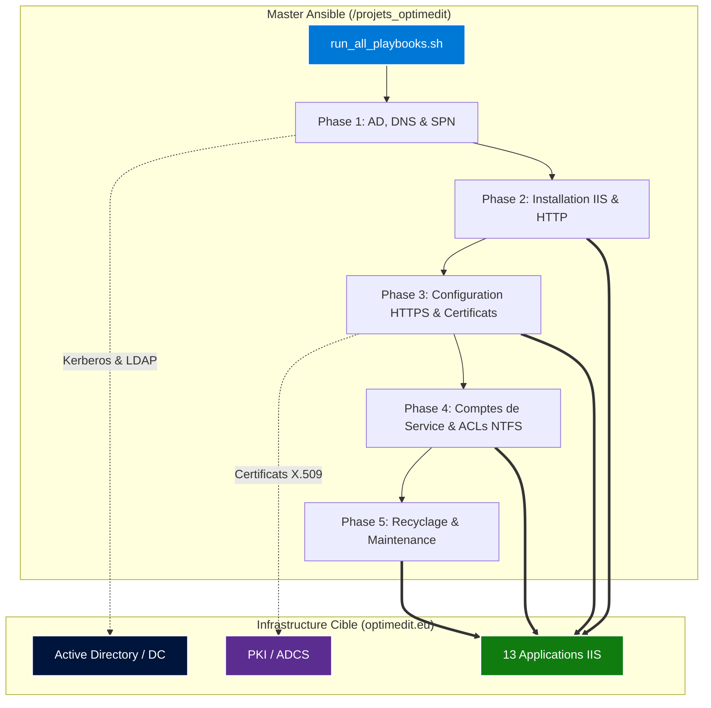

# 🚀 Infrastructure as Code & Automatisation IIS - Optimedit

[](https://www.ansible.com/)
[](https://www.microsoft.com/)
[](https://www.iis.net/)
[](https://learn.microsoft.com/en-us/windows-server/identity/ad-ds/get-started/virtual-boot-factory)
[](https://optimedit.eu)
[](https://optimedit.eu)

Ce dépôt Git centralise l'ensemble de l'**Infrastructure as Code (IaC)** et des scripts de recette permettant de déployer, sécuriser, certifier et durcir une infrastructure web composée de **13 applications métiers** sur le domaine `optimedit.eu`.

---

## 🏗️ Architecture Globale & Technologies

Les technologies et protocoles clés mis en œuvre dans ce projet :

| Composant / Technologie | Rôle / Fonction | Standard / Protocole |
| :--- | :--- | :--- |
| **Active Directory (AD / DC)** | Annuaire central, gestion des identités et des groupes | LDAP, Kerberos |
| **Active Directory Certificate Services (ADCS)** | PKI interne d'entreprise (Autorité de Certification) | X.509, Auto-Enrollment |
| **DNS & SMB** | Résolution de noms et partage sécurisé de fichiers | DNS, SMB v3 |
| **Microsoft IIS** | Serveur web haute disponibilité (13 applications) | HTTP / HTTPS (TLS 1.2 / 1.3) |
| **Kerberos & Delegation** | Authentification inter-services et support du "Double Hop" | SPN, Kerberos Constrained Delegation |
| **Ansible Automation** | Moteur d'orchestration et déploiement out-of-band | WinRM / CredSSP / HTTPS |

---

## 🗂️ Vue d'Ensemble de l'Arborescence du Projet

L'infrastructure est divisée en deux grands blocs fondamentaux :
1. **`00.00.install/`** : Les fondations Out-of-Band (AD, PKI, Bootstrap Ansible).
2. **`infra_iis_cert_wc_ansible_v.2.14.18/`** : Le moteur d'orchestration Ansible (Playbooks, Rôles, Variables, Scripts de validation).

<details>
<summary><b>📂 Voir l'arborescence complète du projet (Cliquer pour ouvrir)</b></summary>

```text
/projets_optimedit/iis_infras/
├── 00.00.install/
│   ├── 00.00.commandes_utils.md
│   ├── 00.01.windows/
│   │   ├── AD/
│   │   │   └── 01. (GPO) Configuration services drives/
│   │   │       ├── Configuration-UAC-Mappage.png
│   │   │       ├── Copier-Coller-PolicyDefinitions.ps1
│   │   │       ├── Corrige-SplitToken-compt-admin.ps1
│   │   │       ├── Deploy-OPT-File-Infra_Avec_Users.ps1
│   │   │       ├── Deploy-OPT-File-Infra_Sans_Users.ps1
│   │   │       ├── LogonScript-GPO-.PS1.png
│   │   │       └── LogonScripts/
│   │   │           ├── OptLogonScript.bat
│   │   │           └── OptLogonScript.ps1
│   │   └── ADCS/
│   │       ├── 01.(ADCS) PKI/
│   │       │   ├── CAPolicy.inf
│   │       │   ├── CAPolicy.inf.V1
│   │       │   ├── CAPolicy.pdf
│   │       │   └── CAPolicy-UltraSecurise.inf
│   │       ├── 02.Gen-Cert/
│   │       │   ├── iis/
│   │       │   │   ├── 01.Meth-WC-PFX-CA/
│   │       │   │   ├── 02.Meth-WC-FQDN-PFX/
│   │       │   │   └── 03.Meth-No-WC-No-PFX-Auto-Enroll/
│   │       │   └── winrm/
│   │       │       ├── 01.Meth-HOSTNAME-CredSSP-auto/
│   │       │       ├── 02.Meth-WILDCARD-CA/
│   │       │       └── 03.Meth-FQDN-CA--pref/
│   │       └── 03.Ex-Import-CA3-To-Ansible/
│   │           ├── 03.Export-Import-Cert-CA3-To-Ansible.yml
│   │           └── Optimedit-CA3.cer
│   └── 00.02.ansible/
│       ├── 00.00.add_new_ansible_admin_V3.sh
│       ├── 00.00.setup_complet_multi_admin_ansible_V7_APT-No-PIP.sh
│       └── 00.00.setup_complet_multi_admin_ansible_V7_PIP.sh
└── infra_iis_cert_wc_ansible_v.2.14.18/
    ├── 00.00.audit_winrm_certs/
    ├── 00.00.play_all_interne_create_host_vars_file.yml
    ├── 00.00.requirements.yml
    ├── 00.00.scripts_sh_conf_et_validations/
    ├── 01.00.plays_ad_dns_delegation_spn/
    ├── 02.00.plays_install_iis_pool_http/
    ├── 03.00.plays_conf_https_443_ports_dedies/
    ├── 04.00.plays_pool_indentity_svc_acl_ntfs/
    ├── 05.00.plays_pools_recycling_maintenances/
    ├── group_vars/
    ├── host_vars/
    ├── inventory.yml
    ├── roles/
    └── run_all_playbooks.sh
```
</details>

---

## 📊 Partie 1 : Installation et Prérequis Système (`00.00.install`)

Ce dossier contient la fondation **Out-of-Band** de l'infrastructure, nécessaire avant toute exécution des playbooks Ansible.

| Sous-dossier | Description Technique & Fonctionnelle | Éléments Clés |
| :--- | :--- | :--- |
| **`00.01.windows/AD/`** | Automatisation du provisionnement des serveurs de fichiers et gestion des GPO. | Création de groupes AD imbriqués (locaux, globaux, universels), scripts de mapping UAC et profils Logon (`OptLogonScript.ps1`). |
| **`00.01.windows/ADCS/`** | Cœur de la chaîne de confiance PKI et moteur de création des modèles de certificats. | Fichiers `CAPolicy.inf` durcis, génération de certificats Wildcard (PFX) ou FQDN, et intégration WinRM. |
| **`00.01.windows/Ex-Import-CA3/`** | Procédures d'exportation de la racine de confiance (Root CA) vers le Master Ansible. | Permet d'établir une communication TLS de confiance avec les nœuds gérés. |
| **`00.02.ansible/`** | Outils d'amorçage (*bootstrapping*) du serveur d'automatisation Master Ansible. | Scripts d'installation automatisée (via dépôt APT ou PIP Python) et gestion multi-administrateurs. |

---

## ⚙️ Partie 2 : Orchestration et Déploiement Ansible (`infra_iis_cert_wc_ansible_v.2.14.18`)

Ce dossier constitue le **cerveau** de l'automatisation. Il se décompose en 5 phases séquentielles strictes orchestrées via Ansible.

| Phase de Déploiement | Intitulé du Répertoire | Objectif Opérationnel |
| :---: | :--- | :--- |
| **Phase 1** | `01.00.plays_ad_dns_delegation_spn/` | Préparation AD, création des comptes de service, enregistrements DNS et configuration des **SPN (Double Hop Kerberos)**. |
| **Phase 2** | `02.00.plays_install_iis_pool_http/` | Installation automatisée des rôles Windows IIS et déploiement initial des pages de test `index.html`. |
| **Phase 3** | `03.00.plays_conf_https_443_ports_dedies/` | Configuration HTTPS avancée, nettoyage des liaisons SSL existantes, injection des certificats Wildcard et durcissement des ports. |
| **Phase 4** | `04.00.plays_pool_indentity_svc_acl_ntfs/` | Isolation des processus IIS via des comptes de service dédiés et application rigoureuse des **ACLs NTFS**. |
| **Phase 5** | `05.00.plays_pools_recycling_maintenances/` | Gestion du cycle de vie des Application Pools (journalisation des recyclages, maintenance ASP.NET, planification nocturne). |

---

## 📈 Diagramme d'Architecture & Séquencement

Le diagramme ci-dessous illustre le flux d'exécution et les dépendances entre les composants Active Directory, la PKI et les serveurs IIS cibles :



---

## 🔒 Bonnes Pratiques, Sécurité & Robustesse

Ce projet intègre les exigences industrielles les plus strictes en matière de sécurité des infrastructures Microsoft :

* **🛡️ Cloisonnement & Séparation des Privilèges :** Chaque application IIS s'exécute sous un compte de service Active Directory dédié, éliminant l'utilisation des comptes génériques intégrés (`NetworkService` ou `AppPoolIdentity`).
* **🔑 Gestion Sécurisée des Secrets :** Utilisation systématique d'**Ansible Vault** (`srv_*_vault.yml`) pour chiffrer les mots de passe et données sensibles, séparés des variables publiques (`group_vars/` et `host_vars/`).
* **🔗 Authentification Kerberos & Double Hop :** Configuration rigoureuse des *Service Principal Names (SPN)* et de la délégation Kerberos contrainte pour sécuriser les accès aux partages de fichiers SMB distants sans compromission d'identifiants.
* **📜 Durcisseur SSL/TLS :** Purge des liaisons obsolètes, déploiement automatisé de certificats Wildcard issus de la PKI interne (`ADCS`), et restriction aux protocoles robustes.
* **📋 Traçabilité & Audits Continus :** Scripts de validation shell (`05.00.iis_check_sites_HTTPS_V2.sh`, audits WinRM) intégrés pour garantir la conformité avant et après chaque exécution.

---

## 🚀 Utilisation & Lancement Rapide

Pour lancer le déploiement global de l'infrastructure de test ou de production :

```bash
# 1. Se positionner dans le répertoire du projet Ansible
cd /projets_optimedit/iis_infras/infra_iis_cert_wc_ansible_v.2.14.18

# 2. Vérifier les prérequis et dépendances
ansible-galaxy install -r 00.00.requirements.yml

# 3. Lancer l'ensemble des playbooks de déploiement et de durcissement
./run_all_playbooks.sh
```

---
*Document généré automatiquement pour le domaine **`optimedit.eu`** — Infrastructure gérée par Driss Benelkaid.*
